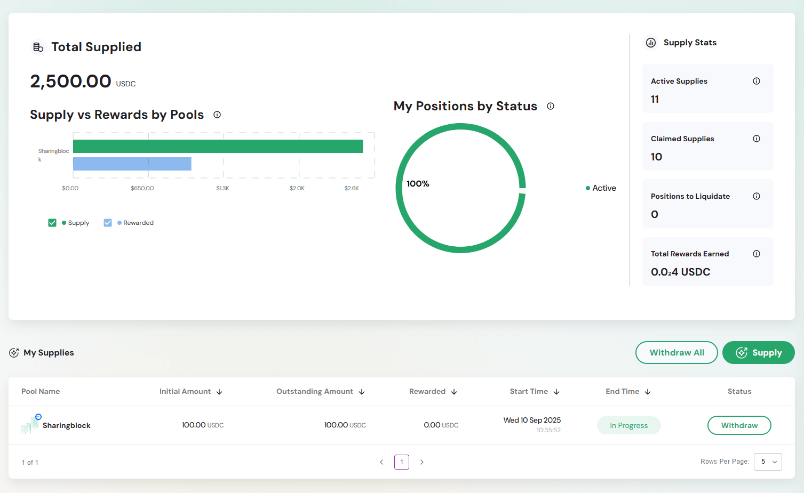
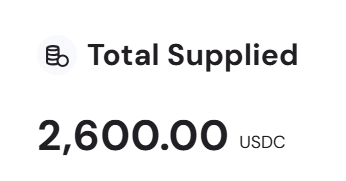
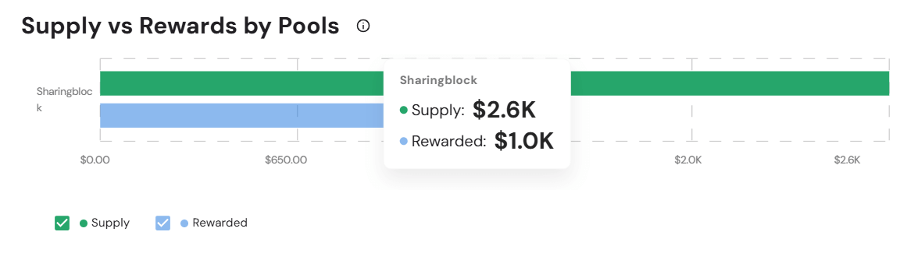
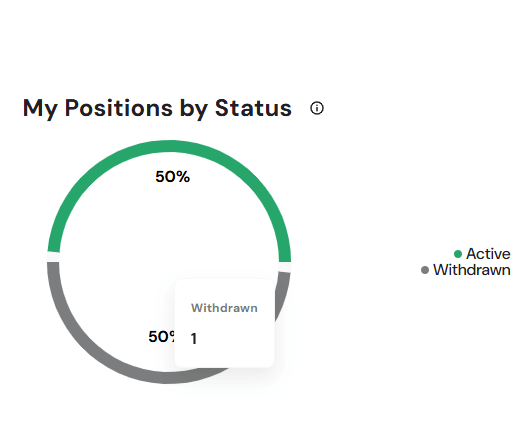
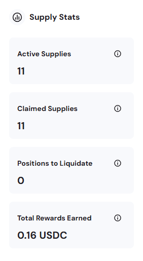
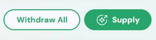
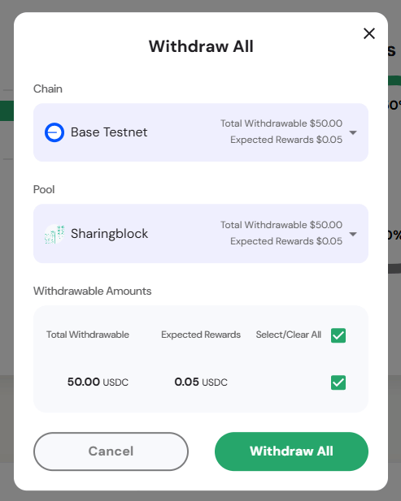
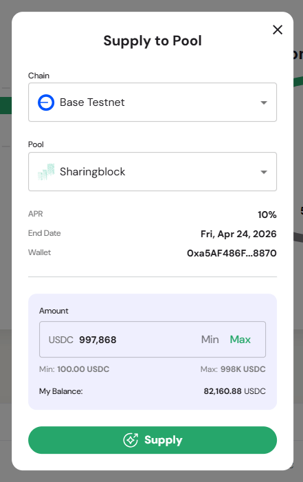
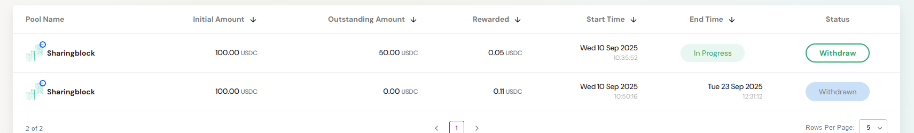

The Supplied page provides a comprehensive view of all your lending positions across pools on the Defactor platform. It serves as your portfolio management hub for tracking supplied assets, earned rewards, and managing supply positions.

---

## Dashboard Overview  

The dashboard provides:  
- **Total Supplied** – Aggregate value of all assets currently supplied across pools  
- **Supply vs Rewards by Pools** – Bar chart comparing supplied amounts against rewards earned for each pool  
- **My Positions by Status** – Circular chart showing the health and activity of your supply positions  
- **Supply Stats Panel** – Key performance metrics including active supplies, claimed supplies, liquidation alerts, and total rewards earned  
- **My Supplies Table** – Detailed view of each supply position with sortable columns and management actions  

## Overview Metrics  

### Total Supplied

**Primary Metric Display**
- Large numerical display showing total supplied amount
- Denominated in USDC
- Represents aggregate value across all pool positions

### Supply vs Rewards by Pools  

The **Supply vs Rewards** chart compares the amount of assets you’ve supplied to each pool against the rewards those supplies have generated.  

**Horizontal Bar Chart**  
- Provides a side-by-side view of **supply amounts** versus **rewards earned**  
- Breaks down performance **pool by pool**  
- Uses a two-color visualization:  
  - **Supply** (green bar) – Principal amount supplied into each pool  
  - **Rewarded** (blue bar) – Rewards earned from that supply  

**Tooltip Details**  

When hovering over a pool, the tooltip displays:  
- **Supply** – The exact USDC amount currently supplied
- **Rewarded** – The rewards earned from that supply

> This chart makes it easy to evaluate the effectiveness of your supplies by comparing how much you’ve committed to each pool against the rewards it has generated.  

### My Positions by Status  

The **My Positions by Status** chart gives a snapshot of the overall state of your supply positions. It shows how many are currently active and how many have been withdrawn or closed.  

**Circular Progress Chart**  
- Displays the proportion of positions by status (e.g., Active, Withdrawn)  
- Each status is represented by a **distinct color** for easy differentiation  

**Tooltip Details**  
When hovering over the chart, tooltips display the exact counts:  
- **Active** – Number of positions currently open and earning rewards  
- **Withdrawn** – Number of positions that have been closed or exited  

> This chart provides a quick health check of your portfolio, letting you see at a glance whether most of your supplies are still active or if a portion has already been withdrawn.

### Key Performance Metrics  

The **Supply Stats Panel** highlights four key metrics that summarize your supply portfolio:  

- **Active Supplies** – The current number of active supplies.  
- **Claimed Supplies** – The current number of supplies that have been completely withdrawn.  
- **Positions to Liquidate** – Number of borrow positions that are liquidatable.  
- **Total Rewards Earned** – Interest income generated from all borrowing in the pool.  

> This panel provides a quick, at-a-glance summary of your portfolio size, activity history, risk exposure, and total earnings.  

## My Supplies Management

### Action Buttons  

The **Action Buttons** in the My Supplies section provide quick access to portfolio-wide actions:  

- **Withdraw All** – Opens a modal that allows you to withdraw all active supplies at once, including any rewards earned.  
- **Supply** – Opens a modal where you can create a new supply position by selecting a chain, pool, and entering your desired amount.  

#### Withdraw All Modal  

The **Withdraw All** modal enables bulk withdrawal of supplies across all positions:  
- **Chain Selector** – Choose the blockchain network.  
- **Pool Selector** – Shows the pool and available withdrawable amounts.  
- **Withdrawable Amounts** – Displays principal, expected rewards, and a selection toggle.  
- **Withdraw All Button** – Confirms withdrawal of all checked positions and rewards.  
- **Cancel Button** – Closes the modal without taking action.  

#### Supply to Pool Modal  

The **Supply to Pool** modal lets you configure and confirm a new supply position:  
- **Chain Selector** – Choose the blockchain network.
- **Pool Selector** – Select the target pool.  
- **APR & End Date** – Displays reward rate and pool maturity.  
- **Wallet** – Shows connected wallet address.  
- **Amount** – Specify how much you want to supply in the **Amount Input** field. You can use the **Min/Max shortcuts** to quickly set the minimum allowed or the maximum your wallet can provide. Below the field, your **wallet balance** is displayed, showing the total USDC currently available in your connected wallet. This lets you instantly check if you have enough funds to meet the pool’s minimum requirement or to supply the full allowed maximum.  
- **Supply Button** – Confirms and submits the transaction.  

> These action buttons streamline portfolio management, letting you either add new supplies or quickly withdraw from all positions in one step.  

### My Supplies Table  

The **My Supplies Table** provides a detailed breakdown of all your supply positions, showing amounts, rewards, timelines, and current status.  

**Column Structure**  
- **Pool Name** – Pool identifier with logo/branding  
- **Initial Amount** – Original amount supplied in USDC (sortable)  
- **Outstanding Amount** – Remaining position value still active (sortable)  
- **Rewarded** – Rewards earned from the position in USDC (sortable)  
- **Start Time** – Date and time the position was created (sortable)  
- **End Time** – Maturity or closure date/time of the position (sortable)  
- **Status** – Current state of the position (*In Progress* or *Withdrawn*)  
- **Actions** – Available actions, such as **Withdraw** for active positions  

> This table allows you to track the lifecycle of every supply position, from creation to withdrawal, while providing direct controls to manage active supplies.  